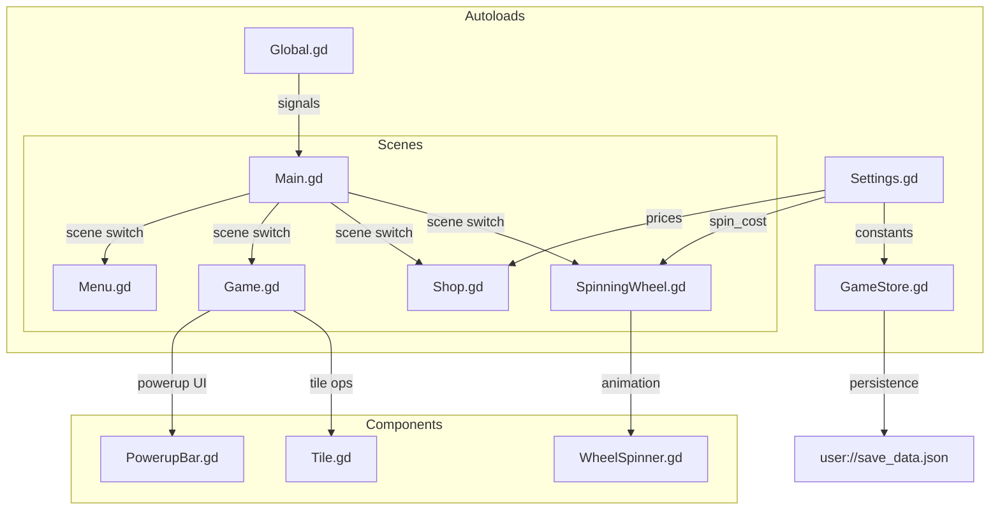
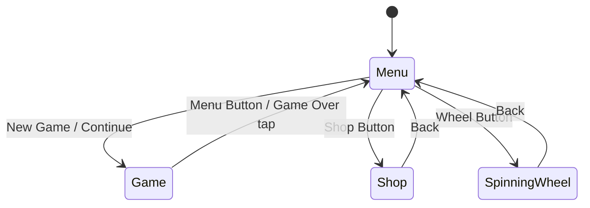
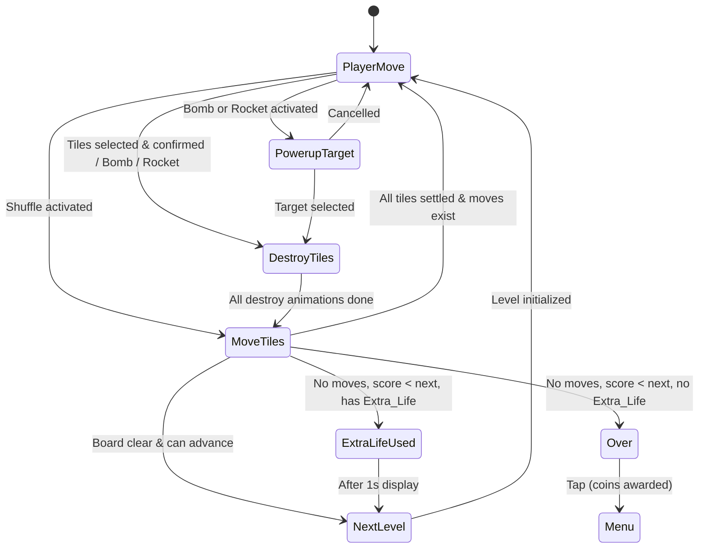

# Design Document: Game Economy and Shop

## Overview

This design adds a coin-based economy, a persistent shop, powerup activation during gameplay, a spinning wheel mini-game, and code quality improvements to SharkGame. The system integrates with the existing autoload architecture (Settings, GameStore, Global, Scenes) and the Game state machine (PlayerMove → DestroyTiles → MoveTiles → Over).

Key design goals:
- Minimal disruption to existing game flow
- All economy constants centralized in Settings.gd
- Persistence via a single JSON file at `user://save_data.json`
- Powerups integrate into the existing state machine without adding new states (except a brief `PowerupTarget` sub-state for Bomb/Rocket targeting)
- Scene transitions use deferred instantiation to fix input leak

## Architecture



### Scene Flow



### Game State Machine (Updated)



## Components and Interfaces

### Modified Files

#### Settings.gd
Add economy constants following the existing `var` pattern:

```gdscript
# Economy
var coins_per_level = 1
var bonus_to_coins_coefficient = 0.5
var bonus_tile_threshold = 10

# Shop prices
var bomb_price = 100
var rocket_price = 250
var shuffle_price = 500
var extra_life_price = 1000

# Spinning wheel
var spin_cost = 100
```

#### GameStore.gd
Extend with persistence and inventory management:

```gdscript
# New persistent state (loaded on _ready, saved on change)
var coins: int = 0
var inventory: Dictionary = {"bomb": 0, "rocket": 0, "shuffle": 0, "extra_life": 0}

const SAVE_PATH = "user://save_data.json"
const MAX_COINS = 999_999_999
const MAX_POWERUP = 99

func _ready():
    randomize()
    load_data()

func load_data():
    # Load from JSON, initialize defaults if missing/corrupt

func save_data():
    # Write coins + inventory to JSON

func add_coins(amount: int):
    coins = mini(coins + amount, MAX_COINS)
    save_data()

func spend_coins(amount: int) -> bool:
    if coins < amount:
        return false
    coins -= amount
    save_data()
    return true

func add_powerup(type: String, count: int = 1):
    inventory[type] = mini(inventory[type] + count, MAX_POWERUP)
    save_data()

func use_powerup(type: String) -> bool:
    if inventory[type] <= 0:
        return false
    inventory[type] -= 1
    save_data()
    return true

func award_game_over_coins():
    var earned = data.level * Settings.coins_per_level
    add_coins(earned)

func award_bonus_coins(remaining_tiles: int, bonus_points: int):
    if remaining_tiles <= Settings.bonus_tile_threshold:
        var bonus_coins = int(floor(bonus_points * Settings.bonus_to_coins_coefficient))
        add_coins(bonus_coins)
```

#### Global.gd
Modernize signal emission syntax and add new signals:

```gdscript
signal scene_changing(target_scene)
signal game_closing
signal game_ending
signal game_starting
signal coins_changed(new_balance)
signal inventory_changed(type, new_count)
```

#### Main.gd
- Add deferred scene instantiation (fix input leak)
- Add Shop and SpinningWheel to scene enum handling
- Remove current scene before deferring new scene add

```gdscript
func on_scene_changing(scene_enum):
    clear_scene()
    # Defer by one frame to prevent input leak
    await get_tree().process_frame
    instantiate_scene(scene_enum)
```

#### Scenes.gd
Add new scene preloads and enum values:

```gdscript
enum SceneEnum { Menu, Game, Shop, SpinningWheel }

var Shop = preload("res://Shop.tscn")
var SpinningWheel = preload("res://SpinningWheel.tscn")
```

#### Menu.gd
- Replace `gui_input` connections with `pressed` signal
- Add Shop and SpinningWheel navigation buttons
- Display coin balance

#### Game.gd
- Replace `gui_input` with `pressed` signals for menu button and game over
- Add PowerupBar integration
- Add `PowerupTarget` sub-state for Bomb/Rocket targeting
- Integrate Extra_Life check in game-over flow
- Award coins on game over
- Award bonus coins on level clear

### New Files

#### Shop.gd (+ Shop.tscn)
Scene with a VBoxContainer listing purchasable items. Each item row shows icon, name, price, and a Buy button. The coin balance is displayed at the top.

**Interface:**
- `_ready()`: Populate item list from Settings prices, update affordability
- `_on_buy_pressed(item_type: String)`: Attempt purchase via `GameStore.spend_coins()` / `GameStore.add_powerup()`
- `_on_back_pressed()`: Navigate to Menu
- `update_affordability()`: Enable/disable buy buttons based on coin balance

#### SpinningWheel.gd (+ SpinningWheel.tscn)
Scene with a circular wheel divided into 9 equal segments, a spin button, and coin display.

**Interface:**
- `_ready()`: Set up wheel segments, check affordability
- `_on_spin_pressed()`: Deduct coins, start spin animation
- `_on_spin_complete(segment_index: int)`: Award prize, show result
- `get_prize(index: int) -> Dictionary`: Return prize type and amount for segment

**Prize table (9 segments, equal 1/9 probability):**
| Index | Prize |
|-------|-------|
| 0 | Nothing |
| 1 | 1x Bomb |
| 2 | 1x Rocket |
| 3 | 2x Bomb |
| 4 | 1x Shuffle |
| 5 | 3x Bomb |
| 6 | 1x Extra_Life |
| 7 | 1000 coins |
| 8 | 3x Bomb |

**Spin animation:** Rotate the wheel node using a Tween with an ease-out curve over 2–4 seconds (randomized duration). Final rotation determines the winning segment.

#### PowerupBar.gd (+ PowerupBar.tscn)
HBoxContainer displayed at the bottom of the Game scene showing powerup buttons with inventory counts.

**Interface:**
- `update_counts()`: Refresh displayed counts from `GameStore.inventory`
- Signals: `bomb_activated`, `rocket_activated`, `shuffle_activated`
- Buttons disabled when count is 0 or game state is not PlayerMove

### Algorithms

#### Bomb (3x3 area clear)
```
Input: center_x, center_y (board coordinates)
1. For dx in [-1, 0, 1]:
     For dy in [-1, 0, 1]:
       target_x = center_x + dx
       target_y = center_y + dy
       if target_x in [0..9] and target_y in [0..9]:
         tile = get_tile(tiles, target_x, target_y)
         if tile != null:
           add to destroy list
2. Destroy all tiles in list (no points awarded)
3. Transition to DestroyTiles state
```

#### Rocket (column clear)
```
Input: column_x (0–9)
1. Collect all tiles where tile.data.x == column_x
2. If list is empty: cancel, return to PlayerMove
3. Calculate points: tile_count^2 * tile_point
4. Destroy all tiles, award points
5. Transition to DestroyTiles state
```

#### Shuffle (maximize vertical adjacency per column)
```
For each column independently:
  1. Collect all tile colors in the column
  2. Count frequency of each color
  3. Sort tiles by color, grouping same colors together
     (greedy: place most frequent color first, then next, etc.)
  4. Assign new y positions (bottom-up, maintaining gravity)
  5. Update tile.data.y for each tile
Transition to MoveTiles state (existing animation handles movement)
```

The greedy grouping maximizes vertical adjacency because placing all tiles of the same color consecutively in a column creates the maximum number of adjacent same-color pairs.

#### Spinning Wheel Prize Selection
```
1. Generate random float in [0, 2*PI) for final wheel position
2. Calculate spin duration: randf_range(2.0, 4.0)
3. Total rotation = multiple full rotations + final position
4. Tween wheel rotation with ease-out
5. On complete: segment_index = floor(final_angle / (2*PI / 9))
6. Look up prize table, award prize
```

## Data Models

### Persistent Save Data (`user://save_data.json`)

```json
{
  "coins": 0,
  "inventory": {
    "bomb": 0,
    "rocket": 0,
    "shuffle": 0,
    "extra_life": 0
  }
}
```

**Constraints:**
- `coins`: integer, range [0, 999_999_999]
- Each inventory value: integer, range [0, 99]

### GameStore Runtime State

```gdscript
# Existing (unchanged)
var data = {
    "score": 0,
    "next": 0,
    "level": 0,
    "tiles": []
}

# New persistent fields (separate from per-game data)
var coins: int = 0
var inventory: Dictionary = {
    "bomb": 0,
    "rocket": 0,
    "shuffle": 0,
    "extra_life": 0
}
```

The `coins` and `inventory` persist across games. The `data` dictionary is per-session game state (created on new_game, cleared on game end).

### Shop Item Configuration

Prices are read from Settings at runtime. No separate data model needed — the Shop scene builds its UI from these constants:

| Item | Settings Key | Default Price |
|------|-------------|---------------|
| Bomb | `bomb_price` | 100 |
| Rocket | `rocket_price` | 250 |
| Shuffle | `shuffle_price` | 500 |
| Extra Life | `extra_life_price` | 1000 |

### Spinning Wheel Prize Model

```gdscript
const PRIZES = [
    {"type": "nothing", "amount": 0},
    {"type": "bomb", "amount": 1},
    {"type": "rocket", "amount": 1},
    {"type": "bomb", "amount": 2},
    {"type": "shuffle", "amount": 1},
    {"type": "bomb", "amount": 3},
    {"type": "extra_life", "amount": 1},
    {"type": "coins", "amount": 1000},
    {"type": "bomb", "amount": 3},
]
```

## Correctness Properties

*A property is a characteristic or behavior that should hold true across all valid executions of a system — essentially, a formal statement about what the system should do. Properties serve as the bridge between human-readable specifications and machine-verifiable correctness guarantees.*

### Property 1: Coin Award on Game Over

*For any* game level number (≥ 1) and any existing coin balance, when the game enters Game_Over_State, the coins awarded shall equal `level * coins_per_level` and the new balance shall equal `old_balance + level * coins_per_level`.

**Validates: Requirements 1.1**

### Property 2: Bonus Coin Calculation

*For any* level completion with a given number of remaining tiles and bonus points earned: if remaining tiles ≤ `bonus_tile_threshold`, the bonus coins awarded shall equal `floor(bonus_points * bonus_to_coins_coefficient)`; if remaining tiles > `bonus_tile_threshold`, the bonus coins awarded shall equal zero.

**Validates: Requirements 2.1, 2.3**

### Property 3: Persistence Round Trip

*For any* valid game state (coins in [0, 999_999_999] and each powerup count in [0, 99]), serializing the state to JSON and then deserializing it shall produce an identical state.

**Validates: Requirements 3.2**

### Property 4: Value Clamping

*For any* coin addition that would result in a value exceeding 999_999_999, the stored coin balance shall be clamped to 999_999_999. *For any* powerup addition that would result in a count exceeding 99, the stored count shall be clamped to 99. In both cases, the value shall never be negative.

**Validates: Requirements 3.5**

### Property 5: Purchase Transaction Integrity

*For any* shop item with a defined price and any coin balance ≥ that price, executing a purchase shall result in the new coin balance equaling `old_balance - price` and the corresponding powerup inventory count increasing by exactly 1.

**Validates: Requirements 4.3**

### Property 6: Affordability Determination

*For any* coin balance and any item price (including spin_cost), the item shall be marked as affordable if and only if `balance >= price`.

**Validates: Requirements 4.4, 9.3**

### Property 7: Powerup Button Enabled State

*For any* powerup type (Bomb, Rocket, Shuffle), the corresponding activation button shall be enabled if and only if the inventory count for that type is ≥ 1 AND the current game state is PlayerMove.

**Validates: Requirements 5.1, 6.1, 7.1**

### Property 8: Bomb Area Destruction

*For any* board configuration and any center position (cx, cy) where cx ∈ [0,9] and cy ∈ [0,9], activating the Bomb shall destroy exactly the set of tiles whose positions (x, y) satisfy `|x - cx| ≤ 1 AND |y - cy| ≤ 1 AND x ∈ [0,9] AND y ∈ [0,9]`, and shall award zero points for those tiles.

**Validates: Requirements 5.2, 5.4**

### Property 9: Rocket Column Destruction

*For any* board configuration and any column index c ∈ [0,9] that contains at least one tile, activating the Rocket shall destroy all tiles in column c and no tiles in any other column.

**Validates: Requirements 6.2**

### Property 10: Rocket Scoring

*For any* Rocket activation that destroys N tiles (N ≥ 1), the score points awarded shall equal `N * N * tile_point`.

**Validates: Requirements 6.5**

### Property 11: Powerup Consumption

*For any* powerup activation (Bomb on valid target, Rocket on non-empty column, Shuffle), the inventory count for that powerup type shall decrease by exactly 1.

**Validates: Requirements 5.3, 6.4, 7.4**

### Property 12: Shuffle Maximizes Vertical Adjacency

*For any* column of tiles with a given multiset of colors, after applying the Shuffle algorithm, the number of vertically adjacent same-color tile pairs in that column shall be the maximum achievable for that multiset.

**Validates: Requirements 7.2**

### Property 13: Shuffle Preserves Color Multiset

*For any* column of tiles, the multiset of tile colors in that column before the Shuffle shall be identical to the multiset after the Shuffle (no tiles added, removed, or moved across columns).

**Validates: Requirements 7.5**

### Property 14: Spin Cost Deduction

*For any* coin balance ≥ `spin_cost`, executing a spin shall result in the new balance equaling `old_balance - spin_cost` before the spin animation begins.

**Validates: Requirements 9.4**

### Property 15: Prize Segment Mapping and Award

*For any* wheel segment index in [0, 8], the prize lookup shall return the correct prize from the fixed prize table, and when that prize is awarded, the corresponding inventory or coin balance shall increase by exactly the prize amount.

**Validates: Requirements 9.5, 9.6**

## Error Handling

### Persistence Failures
- If `FileAccess.open()` fails on write: retain in-memory state, set a `_save_pending` flag, reattempt on next state change.
- If `FileAccess.open()` fails on read (startup): initialize defaults (coins=0, all powerups=0). No error shown to player.
- If JSON parsing fails (corrupt file): same as missing file — initialize defaults.

### Invalid State Guards
- `spend_coins()` returns `false` if balance < amount — caller must check before proceeding.
- `use_powerup()` returns `false` if count ≤ 0 — UI should prevent this, but the guard exists as defense.
- Bomb/Rocket targeting cancelled if player taps the powerup button again or taps outside the board.
- Rocket on empty column: cancel without consuming (checked before `use_powerup()` is called).

### Edge Cases
- Coin overflow: clamped to 999,999,999 via `mini()`.
- Powerup overflow: clamped to 99 via `mini()`.
- Bomb at corner (e.g., 0,0): only 4 tiles in the 3x3 area exist — destroy only those.
- Shuffle on single-tile column: no rearrangement needed, still consumes one Shuffle.
- Extra_Life with score exactly at threshold: Extra_Life is NOT consumed (player advances normally via `can_advance()`).

## Testing Strategy

### Unit Tests (Example-Based)
- **Persistence defaults**: Missing file → coins=0, all powerups=0
- **Persistence corrupt file**: Invalid JSON → defaults
- **Extra_Life activation**: Correct conditions trigger level advance
- **Extra_Life not available**: Game over state entered
- **Rocket on empty column**: Cancelled, no consumption
- **Rocket cancellation**: Re-press returns to PlayerMove
- **Shop display**: Correct prices shown from Settings
- **Spinning wheel prizes**: Each segment awards correct prize
- **Scene transitions**: Deferred instantiation prevents input leak

### Property-Based Tests (GdUnit4 + custom generators)
- **Library**: [GdUnit4](https://github.com/MikeSchulworthy/gdUnit4) with custom property test harness
- **Minimum iterations**: 100 per property
- **Tag format**: `# Feature: game-economy-and-shop, Property {N}: {title}`

Since Godot/GDScript lacks a mature PBT library like QuickCheck, property tests will be implemented as GdUnit4 test cases with a custom `repeat(N)` loop and randomized input generation via helper functions (e.g., `rand_coins()`, `rand_inventory()`, `rand_board()`). Each test generates random inputs, applies the function under test, and asserts the property holds.

**Property tests to implement:**
1. Coin award formula (Property 1)
2. Bonus coin calculation (Property 2)
3. Persistence round trip (Property 3)
4. Value clamping (Property 4)
5. Purchase transaction (Property 5)
6. Affordability determination (Property 6)
7. Bomb area destruction (Property 8)
8. Rocket column destruction (Property 9)
9. Rocket scoring (Property 10)
10. Powerup consumption (Property 11)
11. Shuffle maximizes adjacency (Property 12)
12. Shuffle preserves colors (Property 13)
13. Spin cost deduction (Property 14)
14. Prize segment mapping (Property 15)

**Note**: Property 7 (powerup button enabled state) is a UI-state property best verified via integration tests in the running scene rather than pure property tests.

### Integration Tests
- Full game-over flow: coins awarded → persisted → menu shown
- Shop purchase flow: buy item → balance updated → inventory updated → UI refreshed
- Spinning wheel flow: spin → animation → prize awarded → persisted
- Powerup activation flow: activate → target → destroy → reposition → state returns to PlayerMove
- Scene transition: no input leak between scenes

